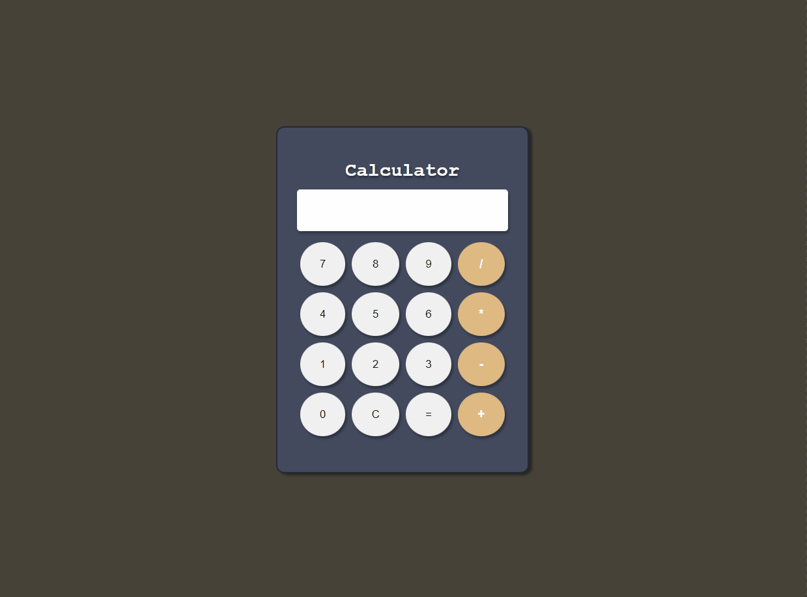

# Web Calculator
[🇺🇸 English](./README.en.md) | [🇧🇷 Português](./README.md)


My first web calculator built with pure JavaScript! This project marks an important milestone in my frontend development learning journey, focusing on mastering JavaScript fundamentals, DOM manipulation, and responsive design.

---

### 📋 Table of Contents
- [Project Overview](#-project-overview)
- [Directory Structure](#-directory-structure)
- [Features & Highlights](#-features--highlights)
- [Technologies Used](#-technologies-used)
- [Prerequisites](#-prerequisites)
- [Installation](#-installation)
- [How to Use](#-how-to-use)
- [Learning & Challenges](#-learning--challenges)
- [Responsiveness](#-responsiveness)
- [Validation and Error Handling](#-validation-and-error-handling)
- [Contributing](#-contributing)
- [License](#-license)
- [Author](#-author)

---

## 🚀 Project Overview

[](https://emellybmuniz.github.io/calculadora-simples/)

This was my **first web calculator** and represents a fundamental project in my JavaScript learning journey! Built with complete focus on web technology fundamentals, without using any frameworks or external libraries - just pure HTML, CSS, and JavaScript.

**Context and Motivation:**
This project was born from the need to put into practice the basic JavaScript concepts I was learning, especially DOM manipulation, events, and programming logic. It was my first real experience creating a complete interactive application.

**Learning Objectives:**
- ✅ Master DOM manipulation with vanilla JavaScript
- ✅ Learn event handling (click, keydown)
- ✅ Practice programming logic and conditional structures
- ✅ Implement basic data input validation
- ✅ Apply responsive design concepts in practice
- ✅ Understand the complete development cycle of a web application

**Why a Calculator?**
I chose a calculator as my first project because it involves all the fundamental concepts that a beginner developer needs to master: element manipulation, events, validation, calculations, and visual feedback - all within a manageable scope.

**Target Audience:** Other beginner developers who, like me, are taking their first steps in JavaScript and want to see a practical example of how to apply basic concepts in a real project.

## 📂 Directory Structure

```bash
📦 calculadora-simples/
├── src/
│   ├── script/
│   │   └── script.js         # Main calculator logic
│   └── styles/
│       └── main.css          # CSS styles with custom variables
├── .gitattributes            # Git configuration for normalization
├── index.html                # Application HTML structure
├── LICENSE                   # Project license
└── README.md                 # This file
```

## ✨ Features & Highlights

### 🧮 **Basic Mathematical Operations**
- Four fundamental operations: addition (+), subtraction (-), multiplication (*), and division (/)
- Simple display that shows the expression being typed
- Clear button (C) to reset calculations
- Calculate execution with "=" button or Enter key

### 🎨 **Simple and Functional Interface**
- Clean layout inspired by classic calculators
- Soft color palette defined with CSS variables
- Responsive buttons with basic visual feedback
- Grid design organized in 4 columns for easy navigation

### 📱 **Basic Responsiveness**
- Adaptation between desktop and mobile with media queries
- Different behaviors for touch devices
- Layout that adjusts to different screen sizes

### ✅ **Essential Validation**
- Prevention of non-numeric character input
- Basic error handling with try-catch
- Simple user input sanitization
- Error messages when something goes wrong ("Invalid calculation!")

### 🔄 **Dual Interaction**
- Functionality via interface button clicks
- Basic keyboard typing support
- Prevention of consecutive duplicate operators

## 🛠️ Technologies Used

This project was built using the following technologies:


### Technical Details:
- **HTML5**: Basic semantic structure with form elements and buttons
- **CSS3**: CSS Grid usage for layout, custom properties for colors, and media queries for responsiveness
- **Vanilla JavaScript**: DOM manipulation, event listeners, and basic calculation logic

## ⚙️ Prerequisites

**For local development:**
- Modern web browser (Chrome 60+, Firefox 55+, Safari 12+, Edge 79+)
- Code editor (VS Code recommended)
- Optional local server (Live Server, Python SimpleHTTPServer, etc.)

**For usage:**
- Any web browser with JavaScript support enabled

## 📦 Installation

```bash
# 1. Clone this repository
$ git clone https://github.com/emellybmuniz/calculadora-simples.git

# 2. Navigate to the project directory
$ cd calculadora-simples

# 3. Open the index.html file in your browser
# Or start a local server (optional)
$ python -m http.server 8000
# Access: http://localhost:8000
```

**Alternative:** [Access the online version](https://emellybmuniz.github.io/calculadora-simples/)

## 💡 How to Use

1. **Number Input** - Click on numeric buttons (0-9) or use keyboard keys
2. **Mathematical Operations** - Click on operators (+, -, *, /) or use corresponding keys
3. **Calculate Result** - Press "=" or Enter key to execute the calculation
4. **Clear Display** - Click the "C" button or press Backspace to clear
5. **Sequential Operations** - Execute multiple operations without needing to clear

### Usage Examples:

```javascript
// Simple operations
7 + 3 = 10
15 - 8 = 7
6 * 4 = 24
20 / 5 = 4

// Sequential operations
5 + 3 * 2 = 16 (precedence respected)
100 - 25 + 10 = 85

// Handled special cases
5 / 0 = "Invalid calculation!"
text = "Invalid calculation!"
```

## 📚 Learning & Challenges

### 💡 **Main Learnings**
- **DOM Manipulation**: How to select elements and dynamically modify content
- **Event Listeners**: Difference between click and keydown events, and how to capture them
- **Programming Logic**: Conditional structures (if/else) to control application flow
- **CSS Grid**: First contact with grid layout to organize buttons
- **Responsive Design**: How to use media queries to adapt the interface
- **Debugging**: Importance of console.log and DevTools to find errors

### 🎯 **Challenges Overcome**
- **Avoiding Consecutive Operators**: Implement logic to prevent "+++" or "**" in expressions
- **Keyboard + Mouse Integration**: Making both input types work together harmoniously
- **Error Handling**: Learning about try-catch and how to handle when something goes wrong
- **CSS Variables**: First time organizing colors in custom variables
- **Function vs eval()**: Discovering a safer way to evaluate mathematical expressions

### 🤔 **Learning Reflections**
During development, I realized that:
- Vanilla JavaScript requires more code, but teaches the fundamentals better
- Organizing CSS with variables makes maintenance much easier
- Testing on different devices is essential (learned this hands-on!)
- Commenting code helps a lot when I come back to review later
- Small UX details make all the difference in the final experience

## 📱 Responsiveness

### Desktop (≥ 800px)
- Complete hover effects on all buttons
- Layout optimized for mouse interaction
- Enhanced visual feedback with smooth transitions
- Buttons with distinct visual states (normal, hover, active)

### Mobile and Tablet (< 800px)
- Hover effects disabled for better touch performance
- Buttons sized optimized for touch (44px minimum)
- Compact layout that adapts to smaller screens
- Touch-friendly interactions without state conflicts

**Breakpoints used:**
- Mobile: < 800px (touch-first design)
- Desktop: ≥ 800px (mouse-optimized design)

## 🛡️ Validation and Error Handling

### Implemented Validations:
- **Keyboard Input**: Block characters that aren't numbers or basic operators
- **Repeated Operators**: Check if an operator already exists at the end before adding another
- **Valid Expressions**: Remove dangerous characters before calculating

### Error Handling:
- **Basic try-catch** to capture errors when calculation cannot be resolved
- **Infinite result verification** for cases like division by zero
- **Friendly message** ("Invalid calculation!") when something goes wrong
- **Character cleanup** with simple regex to keep only numbers and operators

### Handled Error Cases:
| Situation | How I Handled | Result |
|-----------|---------------|--------|
| Division by zero | Check if result is infinite | "Invalid calculation!" |
| Letters typed | Block in event listener | Nothing happens |
| Malformed expression | Try-catch in calculation | "Invalid calculation!" |
| Consecutive operators | Check end of string | Ignore second operator |

**Note:** Since this was my first project, error handling is basic but functional. In future projects I plan to implement more robust validations!

## 🤝 Contributing

Contributions are always welcome and **much appreciated!** Feel free to open an _issue_ or send a _pull request_.

### How to contribute:
1. **Fork** this repository
2. **Clone** your fork: `git clone https://github.com/your-username/calculadora-simples.git`
3. **Create a branch** for your feature: `git checkout -b feature/new-functionality`
4. **Make your changes** and test thoroughly
5. **Commit** your changes: `git commit -m 'Add new functionality'`
6. **Push** to the branch: `git push origin feature/new-functionality`
7. **Open a Pull Request** with detailed description of changes

### Contribution Guidelines:
- Keep code simple and educational (it's a learning project!)
- Comment complex parts to help other beginners
- Test on different devices before submitting PR

## 🔑 License

This project is licensed under the **MIT License** - see the [LICENSE](LICENSE) file for more details.

The MIT License allows commercial use, modification, distribution, and private use of the code, requiring only the inclusion of the copyright and license.

## ✍️ Author

Crafted with ❤️ by **Emelly Beatriz**

📬 Get in touch:

📧 emellybmuniz@gmail.com |
💼 [Linkedin](https://www.linkedin.com/in/emellybmuniz) |
🐙 [Github](https://github.com/emellybmuniz)

---

⭐ **Did you like the project?** Leave a star on the repository to support development!

